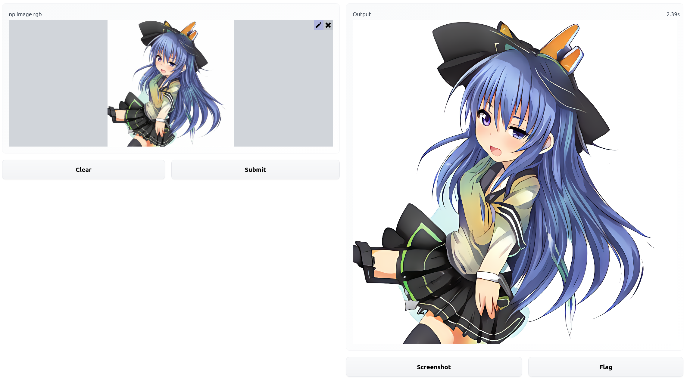

## Demo


## How to run it?
```
pip install -r requirements.txt

python app.py

# Access shown URL.
```

The running speed is slow when running on gradio. 
Please try running it in your own program.

## License
The code and the model used in this folder is licensed under [MIT license](LICENSE).
You can get model directly from [Hugging Face](https://huggingface.co/xiongjie/realtime-SRGAN-for-anime).